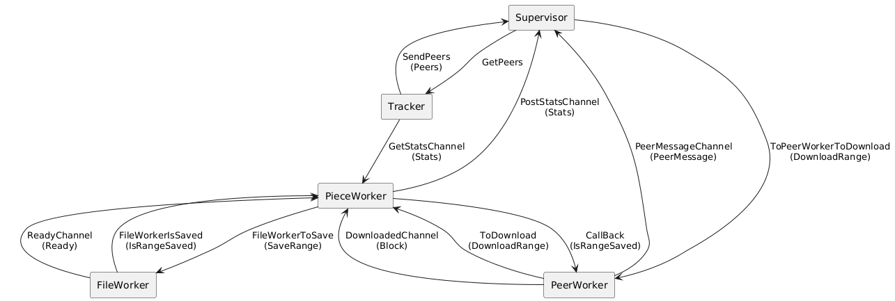

# Torrent Client

## Features

1. Multithreaded downloading, validation, piece processing, and disk writing.
2. Supports multifile torrents and multiple torrents simultaneously.
3. Uses an actor-based architecture. Each torrent has separate worker pools, each with a dedicated role.
4. Resilient to network errors and disk write failures.

## Architecture

### Supervisor

The supervisor creates a pool of piece workers and a dynamic pool of peer workers, distributes tasks to peer workers, monitors their status, and if necessary, reassigns tasks. There is one supervisor goroutine per torrent. In case of connection drops, it queues the peers and attempts to reconnect after some time.

### Tracker Worker

The tracker worker periodically queries the tracker for peer information and passes it to the supervisor. It supports multifile torrents and torrents with multiple trackers.

### Piece Worker Pool

A pool of piece workers that manage the state of pieces, validate them, and upon request from file workers, assemble larger blocks for writing to disk. Initially, a single managing structure is created with various locks and structures containing ranges of downloaded data, sent data, and already written data. This approach allows handling errors and avoiding issues with concurrent data access due to the asynchronous and distributed nature of the system.

### Peer Worker Pool

Each peer worker has its own peer address. It sends all messages to the supervisor and receives commands from it (e.g., download a specific range of data). The worker splits the range into pieces and blocks, writes data to the shared byte array, and notifies piece workers about completed work.

First, it initializes the connection, sends handshakes. Then it creates an auxiliary actor dedicated to reading; when reading, it sends the read messages to the supervisor and only the type of messages to the worker itself. The worker reads commands from the supervisor; if the supervisor sees that the peer is unchoking and has the required pieces, it gives the command to download a certain range of data. Then the worker makes up to 5 requests simultaneously and checks that responses have been received for all requests (it is notified by the auxiliary actor on reading).

### File Worker Pool

File workers are created separately. They receive messages from all torrents but send back the results of disk writes through a channel from the message, the so-called callback channel.

## Interaction Between Actors

[Package message (directory message — files channel.go and message.go)](./message/)

Actors communicate via channels. Each type of actor has its own set of channels. See [message/channel.go](./message/channel.go) for details. Message types are defined in [message/message.go](./message/message.go).

